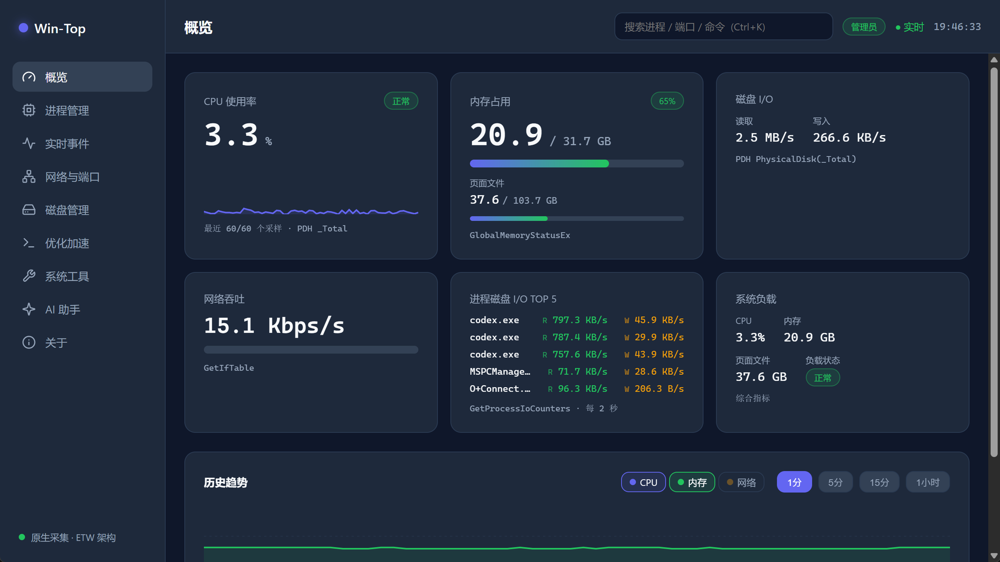
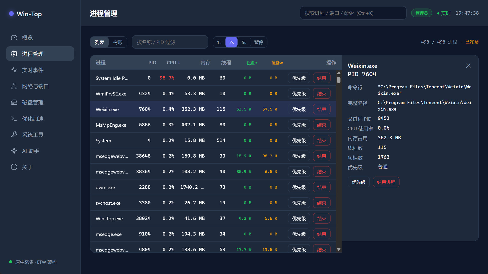
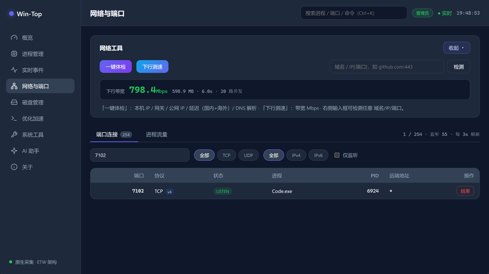
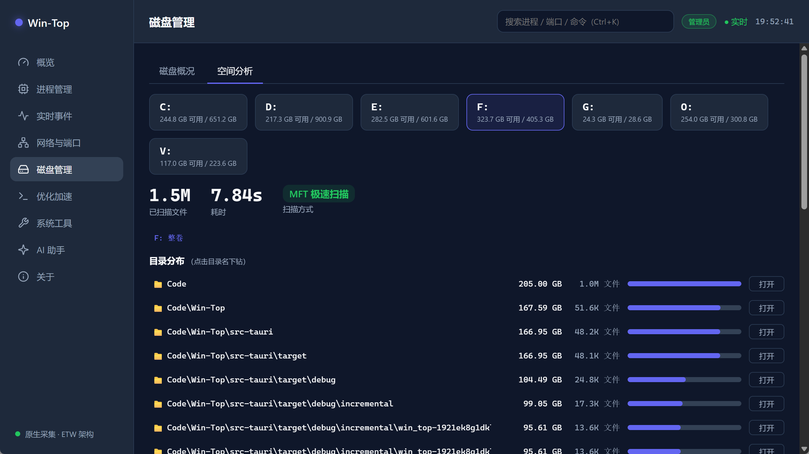
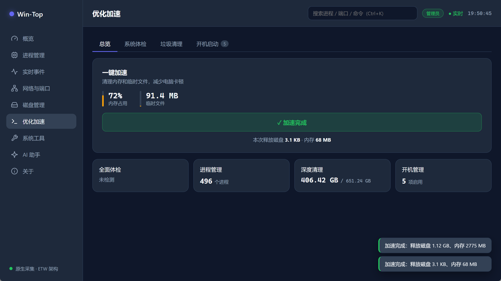
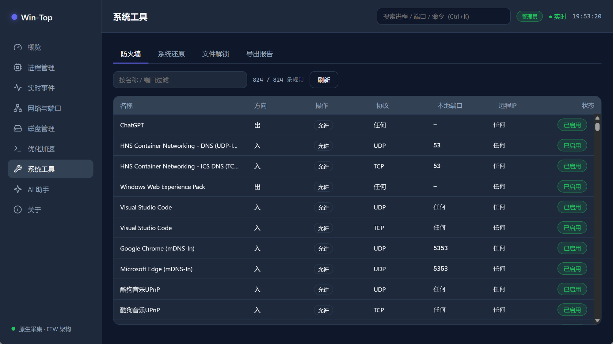
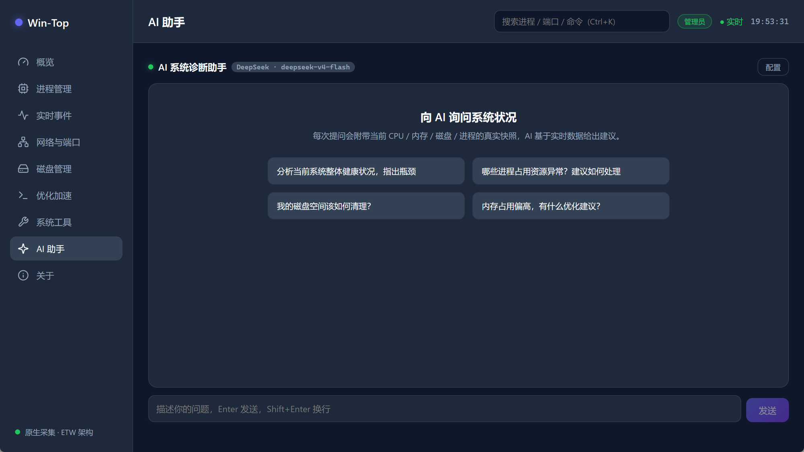

# Win-Top


Win-Top 是一款现代化的 Windows 资源管理工具，聚焦系统与应用资源的可视化监控与一键化管理，集成 AI 能力帮助用户理解系统状态并做出高效决策。它将网络、端口、进程、磁盘、CPU、内存等核心资源统一为一个可扩展的桌面端工作台，把复杂命令变成可理解、可重复的一键操作。

**产品定位**：一体化 Windows 资源管理工作台——对开发者，是端口、进程、开发环境的效率工具；对普通用户，是一键化的"健康检查 + 修复建议"。

---

## 功能与界面

### 概览

系统状态一屏总览：CPU 使用率（含 60 采样趋势曲线与状态评级）、内存与页面文件占用、磁盘读写速率、网络吞吐、进程磁盘 I/O TOP 5、系统负载综合评估。下方为可交互历史趋势图，支持 CPU / 内存 / 网络三条曲线与 1 分 / 5 分 / 15 分 / 1 小时时间窗切换。



### 进程管理

全量进程的列表 / 树形双视图，支持按名称 / PID 过滤，按 CPU、内存、线程、磁盘读写排序，刷新间隔可调（1s / 2s / 5s / 暂停，暂停后表格冻结便于操作）。点击行打开详情面板，展示命令行、完整路径、父进程 PID、句柄数、线程数、优先级；行内即可设置优先级或结束进程，危险操作二次确认。



### 实时事件

基于 ETW 的进程启动 / 退出实时事件流（需管理员权限），支持按进程名过滤、暂停浏览，用于追踪后台进程的频繁启停行为。

### 网络与端口

上半区为网络工具：一键体检（本机 IP / 网关 / 公网 IP / 国内外延迟 / DNS 解析）、多路并发下行测速、任意 `域名/IP:端口` 连通性检测。下半区两个标签页：「端口连接」列出 TCP / UDP 端口 → 进程 → PID 映射，区分 IPv4 / IPv6 与监听状态，支持协议 / 家族 / 仅监听过滤，输入端口号即可定位占用进程并一键结束（自动分析同端口双栈绑定、避免误杀）；「进程流量」基于 ETW Kernel-Network 展示每进程实时上传 / 下载速率。



### 磁盘管理

「磁盘概况」展示分区容量与使用率、物理磁盘 SMART 健康状态与温度（温度需管理员权限）。「空间分析」对整卷做基于 NTFS MFT 的极速扫描——百万级文件数秒完成，输出大目录 / 大文件排行与占比条，支持目录逐级下钻、一键在资源管理器中定位。



### 优化加速

「一键加速」组合垃圾清理与内存释放，实时显示内存占用、临时文件量与本次释放成果；四张状态卡片汇总全面体检、进程数、磁盘可用空间、开机启动项。子标签页提供：系统体检评分、垃圾清理（8 类系统垃圾 + 回收站，符号链接 / junction 安全防护）、开机启动项管理（滑动开关 + 二次确认）。



### 系统工具

- **防火墙**：全量出入站规则查看，按名称 / 端口过滤，规则启用 / 禁用开关
- **系统还原**：一键创建系统还原点
- **文件解锁**：查找并结束占用某个文件的进程
- **导出报告**：系统快照导出（JSON / CSV）



### AI 助手

接入 OpenAI 兼容接口，预置 OpenAI、DeepSeek、Kimi、通义千问、智谱、硅基流动、OpenRouter、Ollama 八家厂商，支持自定义地址与模型。每次提问自动附带当前系统快照（CPU / 内存 / 磁盘 / 进程 / 网络流量），基于真实数据给出诊断建议，并优先引导使用软件内已有功能解决问题。流式输出、Markdown 渲染、生成中可随时停止；API Key 仅保存在本机，不经过任何中间服务器。



---

## 技术栈与架构

**技术栈**：Tauri 1.x · Rust · Svelte 4 · Vite

```
┌──────────────────────────────┐
│          UI Frontend          │
│       Svelte 4 + Vite         │
└─────────────┬────────────────┘
              │ Tauri Bridge（事件推送 + 命令调用）
┌─────────────▼────────────────┐
│        Rust Core Service      │
│  系统采集 / 系统操作 / 权限控制 │
└─────────────┬────────────────┘
              │ Windows APIs
┌─────────────▼────────────────┐
│   PDH / ETW / WMI / WinAPI    │
└──────────────────────────────┘
```

**数据采集**——全部直调 Windows 原生接口，不派生 netstat / powershell 等子进程：

| 能力 | 实现 |
| --- | --- |
| CPU / 磁盘 I/O | PDH 性能计数器 |
| 内存 | `GlobalMemoryStatusEx` |
| 进程枚举 | `NtQuerySystemInformation` |
| 进程操作 | `OpenProcess` / `TerminateProcess` / `SetPriorityClass` |
| 端口连接 | `GetExtendedTcpTable` / `GetExtendedUdpTable` |
| 进程事件 / 每进程流量 | ETW（Kernel-Process / Kernel-Network） |
| SMART / 磁盘温度 | WMI |
| 空间分析 | NTFS MFT 直读 |

**采集模型**：后端常驻采集线程分层采样（指标 1s、进程 2s、磁盘 15s、事件实时），通过事件推送到前端，避免高频轮询。

**权限模型**：默认普通权限运行，核心功能全部可用；ETW 实时事件、磁盘温度需要管理员权限，应用内提供「以管理员重启」一键提权；结束进程、清理磁盘、防火墙变更等风险操作均有确认与提示。

---

## 安装

从 [Releases](https://github.com/nickshui/Win-Top/releases) 下载：

| 文件 | 说明 |
| --- | --- |
| `Win-Top_x.y.z_x64-setup.exe` | NSIS 安装包，推荐 |
| `Win-Top_x.y.z_x64_en-US.msi` | MSI 安装包 |
| `Win-Top_x.y.z_portable_x64.exe` | 绿色便携版，免安装，下载后双击即用 |

**系统要求**：Windows 10 1809+ / Windows 11，x64；依赖 WebView2 运行时（Windows 11 自带；使用安装包时若缺失会自动引导安装）。

> - 便携版不含 WebView2 引导：极少数未预装 WebView2 的系统（多为精简版 Windows 10）需先安装 [WebView2 运行时](https://developer.microsoft.com/zh-cn/microsoft-edge/webview2/)，再运行便携版。
> - 安装包与便携版均暂未做代码签名，SmartScreen 可能提示「未知发布者」，选择「仍要运行」即可。

## 本地构建与启动

依赖：Node.js 18+、Rust stable（MSVC 工具链）。

```bash
npm install
npm run tauri dev     # 开发调试（Vite 热更新 + Rust 后端）
npm run tauri build   # 构建安装包，产物在 src-tauri/target/release/bundle/
```

---

## 待做任务

- [ ] 命令与脚本工具箱：常用命令（ipconfig、sfc、dism 等）参数可视化、模板化、执行日志留存
- [ ] Ctrl+K 命令面板（全局搜索进程 / 端口 / 功能直达）
- [ ] 概览仪表盘增强（模块聚合 Bento 布局）
- [ ] 异常检测与自动化任务（高占用告警、定时清理）
- [ ] 浅色主题、多语言
- [ ] CSP 硬化与安装包代码签名
- [ ] 远程管理、多设备统一监控
- [ ] 插件生态、脚本分享

---

## 设计原则

- **安全第一**：危险操作必须二次确认。
- **可解释性**：执行前说明原因、风险、后果。
- **可追溯性**：所有操作可查看日志与回滚建议。
- **扩展性**：以插件与脚本体系持续演进。

## 项目愿景

Win-Top 的目标是成为 Windows 平台上专业、智能、可扩展的资源管理与系统维护工具。它不仅是一款监控工具，更是一个“系统专家”，帮助用户理解电脑、管理电脑、优化电脑。
